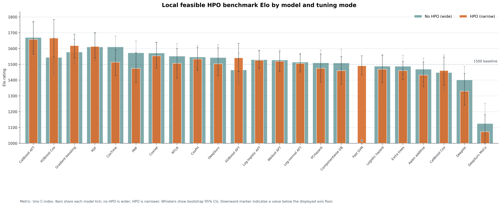

# SurvArena

SurvArena is a Python toolkit for tabular survival analysis on right-censored
data. It supports two complementary workflows:

- `SurvivalPredictor`: an AutoML-style interface for fitting survival models on
  a user dataset
- the benchmark runner: a config-driven workflow for reproducible, shared-split
  method comparisons

The project is designed around practical survival modeling workflows: explicit
time/event labels, consistent preprocessing, comparable validation splits,
leaderboards, persisted artifacts, and manuscript-friendly benchmark summaries.

## Features

- Fit from a pandas `DataFrame`, CSV file, or Parquet file.
- Validate duration and event labels before training.
- Infer feature types and apply training-side preprocessing only.
- Select models with presets or explicit model ids.
- Use automatic validation holdouts, explicit tuning sets, or bagged
  out-of-fold selection.
- Rank fitted models with a unified leaderboard and optional test metrics.
- Save and reload predictors for later inference.
- Predict risk scores and survival curves.
- Plot Kaplan-Meier comparisons for quick model inspection.
- Run benchmark-style comparisons on built-in or user-provided datasets.
- Export fold results, leaderboards, run diagnostics, and experiment manifests.
- Inspect optional tabular foundation-model readiness before fitting.

## Repository Layout

```text
survarena/                 Python package
configs/datasets/          Built-in dataset metadata
configs/methods/           Model adapter configurations
configs/benchmark/         Benchmark experiment configurations
docs/                      Environment, protocol, dataset, and backend docs
scripts/                   Environment setup and validation helpers
tests/                     Pytest suite
data/                      Local raw, processed, and split data directories
```

## Contributing

- Adding method adapters: `docs/contributing_method_adapters.md`
- Adding datasets: `docs/contributing_datasets.md`

## Python Environment

SurvArena is tested for modern CPython environments:

- preferred: Python 3.11
- supported by the setup script: Python 3.10, 3.11, and 3.12
- package metadata: `requires-python = ">=3.10"`

Use a repo-local virtual environment. The dependencies include compiled and
modeling-heavy packages such as `scikit-survival`, `torch`, `torchsurv`,
`autogluon.tabular`, `xgboost`, and `catboost`, so isolated environments are
strongly recommended.

### Recommended Setup

```bash
PYTHON_BIN=python3.11 ./scripts/setup_env.sh
source .venv/bin/activate
python scripts/check_environment.py
```

The setup script creates `.venv`, upgrades `pip`, installs SurvArena in editable
mode with developer tooling by default, and runs the environment check.

Useful setup overrides:

```bash
# Use a different supported interpreter.
PYTHON_BIN=python3.10 ./scripts/setup_env.sh
PYTHON_BIN=python3.12 ./scripts/setup_env.sh

# Use a different virtual environment directory.
VENV_DIR=.venv311 PYTHON_BIN=python3.11 ./scripts/setup_env.sh

# Install optional foundation-model or KKBox extras.
INSTALL_EXTRAS=dev,foundation PYTHON_BIN=python3.11 ./scripts/setup_env.sh
INSTALL_EXTRAS=dev,foundation-tabpfn PYTHON_BIN=python3.11 ./scripts/setup_env.sh
INSTALL_EXTRAS=dev,kkbox PYTHON_BIN=python3.11 ./scripts/setup_env.sh
```

### Manual Setup

```bash
python3.11 -m venv .venv
source .venv/bin/activate
python -m pip install --upgrade pip
python -m pip install -e ".[dev]"
python scripts/check_environment.py
```

Core package only:

```bash
python -m pip install -e .
```

Optional extras:

```bash
python -m pip install -e ".[foundation]"
python -m pip install -e ".[foundation-tabpfn]"
python -m pip install -e ".[tracking]"
```

### Validate the Environment

```bash
python scripts/check_environment.py
python scripts/check_environment.py --include-foundation
survarena foundation-check
```

The environment check reports the active Python executable, virtual environment
status, core imports, optional foundation imports, foundation runtime readiness,
and smoke checks for the `torchsurv` metrics used by SurvArena.

### Local Reference Machine

The bundled `configs/benchmark/local_feasible_hpo_v1.yaml` profile is calibrated
for the local MacBook used for the current feasibility run:

- MacBook Pro, Mac15,6
- Apple M3 Pro, 11 CPU cores (5 performance, 6 efficiency)
- 14-core integrated Apple GPU with Metal support
- 18 GB unified memory
- macOS 26.3.1
- Python 3.12.2 in `.venv`
- PyTorch 2.2.2, `torch.backends.mps.is_available() == True`,
  `torch.cuda.is_available() == False`

For manuscript-grade local ELO construction on this machine, use CPU defaults.
The deep survival adapters resolve `device: auto` to CUDA when available and CPU
otherwise; they do not auto-select Apple MPS. A direct MPS probe of
`torchsurv.loss.cox.neg_partial_log_likelihood` fails on this environment
because PyTorch MPS does not implement `aten::_logcumsumexp`, so Cox-loss neural
training remains CPU-only here.

### Local Feasible HPO Elo Preview

The current local feasible HPO evidence bundle compares native Python adapters
across paired no-HPO and HPO modes. Foundation-model adapters are not included
in this run.



### First Smoke Run

After setup, start with commands that check the benchmark wiring before running
many model fits:

```bash
source .venv/bin/activate

# Confirm imports and metric backends.
python scripts/check_environment.py

# Inspect the smoke benchmark plan without fitting models.
python -m survarena.run_benchmark \
  --benchmark-config configs/benchmark/smoke.yaml \
  --dry-run

# Run the smallest practical built-in benchmark: one dataset, one method,
# one seed/repeat, and the smoke fold geometry.
python -m survarena.run_benchmark \
  --benchmark-config configs/benchmark/smoke.yaml \
  --dataset whas500 \
  --method coxph \
  --limit-seeds 1
```

The one-dataset smoke run writes a timestamped folder under
`results/summary/<dataset_id>/<benchmark_id>/<YYYYMMDD_HHMMSS>/` with
model-prefixed artifacts such as `coxph_fold_results.csv`,
`coxph_leaderboard.csv`, compact run records, and an experiment manifest. Once
this passes, broaden gradually: add more methods, then more datasets, then move
from `smoke.yaml` to `standard_v1.yaml` or a derived manuscript config.

## Quick Start

### Pilot Your Own Dataset

For a quick benchmark-style read on a CSV or Parquet dataset, run:

```bash
survarena pilot \
  --data train.csv \
  --time-col time \
  --event-col event \
  --dataset-name my_dataset
```

The pilot command uses the fast preset by default, evaluates the same
user-provided data path as `compare_survival_models(...)`, and prints a compact
JSON summary with aggregate C-index metrics plus the artifact paths for
`fold_results`, `leaderboard`, `run_diagnostics`, and the experiment manifest.
Add `--models coxph,rsf` for explicit model control or `--repeated` for a small
3-fold x 2-repeat nested-CV pilot before moving to the full benchmark runner.

### Python API

```python
from survarena import SurvivalPredictor

predictor = SurvivalPredictor(
    label_time="time",
    label_event="event",
    presets="medium",
    eval_metric="uno_c",
    retain_top_k_models=2,
)

predictor.fit(
    train_data="train.csv",
    tuning_data="valid.csv",
    test_data="test.csv",
    dataset_name="my_dataset",
    time_limit=1800,
    hyperparameter_tune_kwargs={"num_trials": 12, "timeout": 120},
    refit_full=True,
    num_bag_folds=5,
)

leaderboard = predictor.leaderboard()
summary = predictor.fit_summary()
risk = predictor.predict_risk("test.csv")
survival = predictor.predict_survival("test.csv")
predictor.plot_kaplan_meier_comparison("test.csv")
predictor.save()
```

If `tuning_data` is omitted, SurvArena creates a stratified validation holdout.
Set `num_bag_folds >= 2` to use bagged out-of-fold model selection.

### Command Line

```bash
survarena fit \
  --train train.csv \
  --tuning valid.csv \
  --test test.csv \
  --time-col time \
  --event-col event \
  --presets medium \
  --retain-top-k-models 2 \
  --time-limit 1800 \
  --autogluon-num-trials 12 \
  --tuning-timeout 120 \
  --num-bag-folds 5 \
  --dataset-name my_dataset
```

The CLI prints the fit summary JSON after training and writes predictor
artifacts to disk.

## Data Requirements

Input data can be provided as:

- a pandas `DataFrame`
- a CSV file
- a Parquet file

Each dataset must include:

- a duration column, passed as `label_time` or `--time-col`
- an event indicator column, passed as `label_event` or `--event-col`
- feature columns usable by the selected model adapters

Event labels should indicate whether the event was observed. Duration values
should be positive numeric survival or follow-up times. Optional id columns or
columns that should not be modeled can be removed before fitting or passed to
the compare API as drop columns.

Built-in dataset configs live in `configs/datasets/`. See
[`docs/datasets.md`](docs/datasets.md) for the current benchmark datasets and
metadata contract.

### Built-in Benchmark Datasets

The standard benchmark suite currently uses the six ready-to-run built-in
datasets below. Dataset counts are mirrored from the current loader metadata in
[`docs/datasets.md`](docs/datasets.md); source package names are shown so
readers can trace each dataset back to the upstream survival-analysis ecosystem.

| Dataset ID | Dataset | Source package | Rows | Features | Event rate | Notes |
| --- | --- | --- | ---: | ---: | ---: | --- |
| `support` | SUPPORT | `pycox` | 8,873 | 14 | 68.03% | Mixed clinical variables with moderate censoring. |
| `metabric` | METABRIC | `pycox` | 1,904 | 9 | 57.93% | Breast cancer benchmark used in deep survival literature. |
| `aids` | AIDS | `scikit-survival` | 1,151 | 11 | 8.34% | AIDS Clinical Trial dataset with heavy censoring. |
| `gbsg2` | GBSG2 | `scikit-survival` | 686 | 8 | 56.41% | German Breast Cancer Study Group survival dataset. |
| `flchain` | FLCHAIN | `scikit-survival` | 7,874 | 9 | 27.55% | Serum free light chain dataset with heavier censoring. |
| `whas500` | WHAS500 | `scikit-survival` | 500 | 14 | 43.00% | Worcester Heart Attack Study 500 benchmark. |

`kkbox` is also present as a large-track dataset config. It is loaded from the
local pycox KKBox cache, which must first be prepared with Kaggle credentials,
and remains outside the ready-to-run standard and manuscript benchmark suites.

### KKBox Setup

KKBox is not bundled with SurvArena or pycox. It is derived from Kaggle's
`kkbox-churn-prediction-challenge` files and must be downloaded into pycox's
local cache before `load_dataset("kkbox", ...)` can work.

```bash
# Install optional downloader/extractor dependencies.
python -m pip install -e ".[kkbox]"

# In Kaggle: create an API token, place it at ~/.kaggle/kaggle.json,
# accept the KKBox competition terms, then lock down the token file.
chmod 600 ~/.kaggle/kaggle.json

# Prepare pycox's local KKBox cache.
python -c "from pycox.datasets import kkbox; kkbox.download_kkbox()"

# Verify SurvArena can load it.
python -c "from pathlib import Path; from survarena.data.loaders import load_dataset; d = load_dataset('kkbox', Path.cwd()); print(d.X.shape, int(d.event.sum()))"
```

If the verification command reports that KKBox is not locally available, check
that the Kaggle token is present, the Kaggle account has accepted the competition
terms, and the download command completed without errors.

## Presets and Models

Preset membership and model adapter availability are defined in code and
configuration, with a reader-facing summary below. Use `presets` for the
maintained default portfolios, or select registered adapters explicitly with
`included_models` in Python and `--models` on the CLI.

Method configs live in `configs/methods/`. Foundation-model details and runtime
readiness checks are documented in
[`docs/foundation_models.md`](docs/foundation_models.md).

### Available Model Adapters

The registered model adapters below are available through `included_models`,
`--models`, or benchmark YAML `methods`. "Benchmark use" names the maintained
configs that include each adapter by default; optional foundation adapters
require their documented extras and readiness checks before long runs.

| Method ID | Model / adapter | Family | Package source | Benchmark use |
| --- | --- | --- | --- | --- |
| `coxph` | Cox proportional hazards | Classical | `scikit-survival` | Standard, smoke, manuscript |
| `coxnet` | Regularized Cox model | Classical | `scikit-survival` | Standard, smoke, manuscript |
| `weibull_aft` | Weibull accelerated failure time | Classical | `lifelines` | Smoke, manuscript |
| `lognormal_aft` | Log-normal accelerated failure time | Classical | `lifelines` | Smoke, manuscript |
| `loglogistic_aft` | Log-logistic accelerated failure time | Classical | `lifelines` | Smoke, manuscript |
| `aalen_additive` | Aalen additive hazards | Classical | `lifelines` | Smoke, manuscript |
| `fast_survival_svm` | Fast survival SVM | Classical | `scikit-survival` | Smoke, manuscript |
| `rsf` | Random survival forest | Tree ensemble | `scikit-survival` | Standard, smoke, manuscript |
| `extra_survival_trees` | Extra survival trees | Tree ensemble | `scikit-survival` | Smoke, manuscript |
| `gradient_boosting_survival` | Gradient boosting survival analysis | Boosting | `scikit-survival` | Smoke, manuscript |
| `componentwise_gradient_boosting` | Componentwise gradient boosting survival analysis | Boosting | `scikit-survival` | Smoke, manuscript |
| `xgboost_cox` | XGBoost Cox objective adapter | Boosting | `xgboost` | Smoke, manuscript |
| `xgboost_aft` | XGBoost AFT objective adapter | Boosting | `xgboost` | Smoke, manuscript |
| `catboost_cox` | CatBoost Cox-style calibrated adapter | Boosting | `catboost` | Smoke, manuscript |
| `catboost_survival_aft` | CatBoost survival AFT adapter | Boosting | `catboost` | Smoke, manuscript |
| `deepsurv` | DeepSurv neural Cox model | Deep learning | `torchsurv` | Standard, smoke, manuscript |
| `deepsurv_moco` | DeepSurv momentum-loss variant | Deep learning | `torchsurv` | Smoke, manuscript |
| `logistic_hazard` | Logistic hazard neural survival model | Deep learning | `pycox` | Smoke, manuscript |
| `pmf` | PMF neural discrete-time survival model | Deep learning | `pycox` | Smoke, manuscript |
| `mtlr` | MTLR neural survival model | Deep learning | `pycox` | Smoke, manuscript |
| `deephit_single` | DeepHit single-risk model | Deep learning | `pycox` | Smoke, manuscript |
| `pchazard` | Piecewise constant hazard neural model | Deep learning | `pycox` | Smoke, manuscript |
| `cox_time` | Cox-Time neural survival model | Deep learning | `pycox` | Smoke, manuscript |
| `autogluon_survival` | AutoGluon event-risk survival adapter | AutoML | `autogluon.tabular` | Optional appendix runs |
| `tabpfn_survival` | TabPFN embedding survival head | Foundation | `tabpfn` + `scikit-survival` | Optional foundation runs |

For the end-to-end benchmark flow, including split creation, no-HPO/HPO tracks,
metric aggregation, and exported comparison artifacts, see
[`docs/benchmarking_workflow.md`](docs/benchmarking_workflow.md).

## AutoGluon Usage Contract

SurvArena exposes AutoGluon through one adapter method id:
`autogluon_survival`.
The design intent is to use AutoGluon's tabular model portfolio as a training
backend while keeping SurvArena's survival-centric evaluation and export
contract unchanged.

### Intent and adaptation boundary

- `TabularPredictor.fit(...)` can train many tabular base models plus ensembles
  (for example `WeightedEnsemble_L2`) under one predictor.
- In this repository, that portfolio is adapted to survival by:
  - fitting a binary event-risk model (`event` as label),
  - using event probability as risk score,
  - deriving survival curves via Breslow baseline calibration.
- This is an adaptation layer for right-censored benchmarks, not native
  censored-loss optimization inside `autogluon.tabular`.

### What "all AutoGluon models" means in SurvArena

- SurvArena benchmark rows are keyed by SurvArena `method_id`, not by every
  AutoGluon internal submodel.
- `autogluon_survival` may internally evaluate many AutoGluon tabular models,
  but appears as one method in SurvArena fold/leaderboard CSVs.
- Use two leaderboards for different questions:
  - AutoGluon internal model ranking: `predictor.leaderboard(...)`.
  - Benchmark-level cross-method ranking: `<model_name>_leaderboard.csv`.

### Comparability contract (what to trust for benchmark claims)

- For cross-method survival comparison, treat SurvArena survival exports as
  authoritative (`uno_c`, `harrell_c`, `ibs`, horizon AUC/Brier/calibration/net
  benefit where configured).
- AutoGluon-native tabular task metrics (for example `accuracy`/`roc_auc` for
  internal event modeling) are diagnostic and should not replace SurvArena's
  survival metrics in benchmark conclusions.
- The benchmark runner (`python -m survarena.run_benchmark`) is the canonical
  path for producing comparable artifacts across methods and split geometry.

### Runtime controls and HPO interaction

AutoGluon-related benchmark YAML controls live under `autogluon:` (for example
in `configs/benchmark/standard_v1.yaml`):

- `presets`
- `time_limit_seconds`
- `hyperparameter_tune_kwargs`
- `num_bag_folds`
- `num_stack_levels`
- `refit_full`

Interpretation in outputs:

- `training_backend=autogluon` indicates AutoGluon trained the model.
- `hpo_backend=autogluon` indicates AutoGluon-internal tuning was used.
- SurvArena's native HPO loop applies only when a method exposes a non-empty
  SurvArena `search_space`.

### Recommended usage patterns

- **AutoGluon backend stress test**: Run only `autogluon_survival` to inspect
  AutoGluon-managed behavior and internal leaderboard metadata.
- **Fair benchmark comparison**: Run `autogluon_survival` alongside native
  adapters on shared splits; compare only SurvArena survival metrics and
  benchmark artifacts.

For auditability, check exported fields such as:
`training_backend`, `hpo_backend`, `autogluon_presets`,
`autogluon_best_model`, `autogluon_model_count`, `autogluon_path`,
`bagging_folds`, and `stack_levels`.

### Limitations and open questions

- Event-risk adaptation does not make `autogluon.tabular` a native censored
  survival optimizer.
- Per-AutoGluon-submodel survival rows are not yet first-class benchmark rows;
  current reporting is method-level plus metadata.
- Manuscript-grade claims should continue to rely on the maintained benchmark
  protocol and configs; AutoGluon-heavy tracks are currently positioned as
  dedicated comparison/appendix analyses.

## Compare API

Use `compare_survival_models(...)` for benchmark-style comparisons on a user
dataset.

```python
from survarena import compare_survival_models

summary = compare_survival_models(
    "train.csv",
    time_col="time",
    event_col="event",
    dataset_name="my_dataset",
    models=["coxph", "rsf", "deepsurv"],
    split_strategy="fixed_split",
    seeds=[11],
)
```

CLI equivalent:

```bash
survarena compare \
  --data train.csv \
  --time-col time \
  --event-col event \
  --dataset-name my_dataset \
  --models coxph,rsf,deepsurv \
  --split-strategy fixed_split \
  --seeds 11
```

`fixed_split` is the quick path. Use `repeated_nested_cv` for stricter
benchmark-style evaluation with shared outer and inner splits.

## Benchmark Runner

For a first benchmark run, use `configs/benchmark/smoke.yaml` with `--dataset`,
`--method`, and `--limit-seeds 1` as shown in [First Smoke Run](#first-smoke-run).
The unscoped smoke config is still small relative to standard/manuscript runs,
but it covers all six standard built-in datasets and every manuscript default
method.

Tracked benchmark configs:

- `configs/benchmark/standard_v1.yaml`: standard native portfolio (Cox, RSF,
  DeepSurv) on the six built-in standard datasets, repeated nested CV
- `configs/benchmark/manuscript_v1.yaml`: main-paper native manuscript
  portfolio, repeated nested CV, no-HPO/default-policy only
- `configs/benchmark/smoke.yaml`: small single-seed no-HPO smoke across all
  standard built-in datasets and native manuscript methods
- `configs/benchmark/local_feasible_hpo_v1.yaml`: MacBook-local native
  feasibility profile with paired `no_hpo` and bounded `hpo` tracks across the
  six standard datasets; foundation and AutoGluon adapters are intentionally
  excluded

To evaluate a **single method** (for example one cloud worker per method), use
`--method` and optionally `--dataset` with `standard_v1.yaml` or
`manuscript_v1.yaml` instead of maintaining one YAML per model.

Example:

```bash
python -m survarena.run_benchmark \
  --benchmark-config configs/benchmark/standard_v1.yaml \
  --dataset support \
  --method coxph \
  --limit-seeds 1
```

Simple smoke examples:

```bash
# Dry run only: parse config and print resolved datasets/methods/modes.
python -m survarena.run_benchmark \
  --benchmark-config configs/benchmark/smoke.yaml \
  --dry-run

# Tiny end-to-end run.
python -m survarena.run_benchmark \
  --benchmark-config configs/benchmark/smoke.yaml \
  --dataset whas500 \
  --method coxph \
  --limit-seeds 1

# Slightly broader smoke on one dataset and all smoke methods.
python -m survarena.run_benchmark \
  --benchmark-config configs/benchmark/smoke.yaml \
  --dataset whas500 \
  --limit-seeds 1
```

For smoke no-HPO runs, SurvArena fits each method's configured defaults directly
on each outer-training split. Inner folds are used when HPO is enabled and a
method has a search space.

Dry-run a benchmark configuration without fitting models:

```bash
python -m survarena.run_benchmark \
  --benchmark-config configs/benchmark/standard_v1.yaml \
  --dry-run
```

Resume a partial benchmark run (reusing an output directory):

```bash
python -m survarena.run_benchmark \
  --benchmark-config <same-config-used-for-original-run> \
  --output-dir results/summary/smoke_wo_HPO_coxph_resume_target \
  --resume \
  --max-retries 2
```

The standard protocol uses shared split definitions, training-side
preprocessing, configured tuning budgets, refit-before-test evaluation, and
seeded stochastic methods. Benchmark configs use `comparison_modes` to choose
`no_hpo`, `hpo`, or both result tracks. See
[`docs/protocol.md`](docs/protocol.md) for the full benchmark contract and
[`docs/training_strategy.md`](docs/training_strategy.md) for fold geometry and
runtime planning.

## Foundation Models

Currently wired foundation adapters:

- `tabpfn_survival`

Install and inspect foundation support:

```bash
INSTALL_EXTRAS=dev,foundation PYTHON_BIN=python3.11 ./scripts/setup_env.sh
source .venv/bin/activate
python scripts/check_environment.py --include-foundation
survarena foundation-check
```

TabPFN requires access to the gated model on Hugging Face:

- accept the terms for
  [Prior-Labs/tabpfn_2_5](https://huggingface.co/Prior-Labs/tabpfn_2_5)
- authenticate with `hf auth login` or set `HF_TOKEN` /
  `HUGGINGFACE_HUB_TOKEN`

Foundation adapters are experimental. Smoke defaults keep pretrained backbones
frozen and train only lightweight survival heads; check runtime readiness before
including them in long benchmark runs.

## Outputs and Artifacts

SurvArena writes two main kinds of outputs:

- predictor artifacts for one fitted `SurvivalPredictor`
- benchmark artifacts for multi-method, multi-split comparisons

Predictor artifacts live under `results/predictor/<dataset_name>/` by default.
The most useful files are:

- `leaderboard.csv`: ranked fitted models and metrics
- `fit_summary.json`: model portfolio notes, dataset diagnostics, retained
  models, per-model test metrics, and foundation-model information
- `predictor.pkl`: reloadable predictor object
- `predictor_manifest.json`: reproducibility metadata
- `kaplan_meier_comparison.png`: optional plot when requested

Benchmark runs live under
`results/summary/<dataset_id>/<benchmark_id>/<model_name>/` (or
`<model_name>_<timestamp>` when a prior run for that model already has CSV
artifacts). Outputs are always `core_csv` and include model-prefixed filenames
such as `<model_name>_fold_results.csv`, `<model_name>_leaderboard.csv`, and
`<model_name>_run_diagnostics.csv`, plus `experiment_manifest.json`.

Split definitions are persisted under `data/splits/<task_id>/` so repeated runs
can reuse consistent evaluation partitions.

## Development

Install developer dependencies with the recommended setup script or manually:

```bash
python -m pip install -e ".[dev]"
```

Common checks:

```bash
python scripts/check_environment.py
python -m compileall survarena
python -m survarena.run_benchmark --dry-run
./scripts/validate_benchmark_protocol.sh
pytest
ruff check survarena tests scripts
```

The default `requirements.txt` installs the editable package with `dev` extras:

```bash
python -m pip install -r requirements.txt
```

## Documentation

- [Environment](docs/environment.md)
- [Benchmark protocol](docs/protocol.md)
- [Datasets](docs/datasets.md)
- [AutoGluon backend](docs/autogluon_backend.md)
- [AutoGluon comparison notes](docs/autogluon_comparison.md)
- [Foundation models roadmap](docs/foundation_models.md)
- [Benchmarking workflow](docs/benchmarking_workflow.md)

## License

SurvArena is released under the MIT License. See [`LICENSE`](LICENSE).
