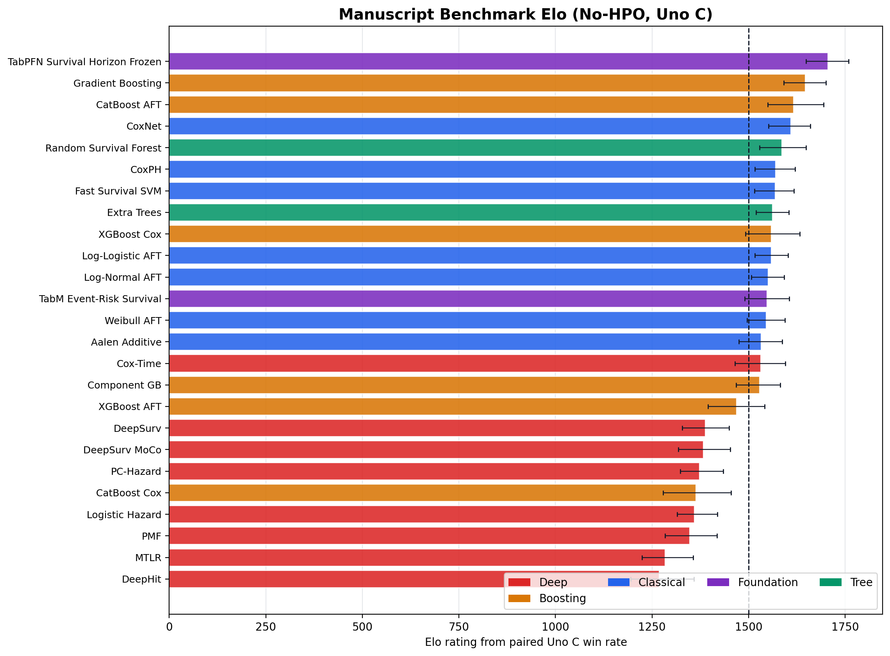

# SurvArena

SurvArena is a Python toolkit for tabular survival analysis on right-censored
data. It supports two complementary workflows:

- `SurvivalPredictor`: an AutoML-style interface for fitting survival models on
  a user dataset
- the benchmark runner: a config-driven workflow for reproducible, shared-split
  method comparisons

The project is designed around practical survival modeling workflows: explicit
time/event labels, consistent preprocessing, comparable validation splits,
leaderboards, persisted artifacts, and manuscript-friendly benchmark summaries.

## Benchmark Preview

Quick view of the current manuscript-grade no-HPO Elo evidence bundle, built
from `configs/benchmark/manuscript_v1.yaml` across 7 datasets, 25 methods, and
15 outer folds per dataset/method pair:



## Features

- Fit from a pandas `DataFrame`, CSV file, or Parquet file.
- Validate duration and event labels before training.
- Infer feature types and apply training-side preprocessing only.
- Select models with presets or explicit model ids.
- Use automatic validation holdouts, explicit tuning sets, or bagged
  out-of-fold selection.
- Rank fitted models with a unified leaderboard and optional test metrics.
- Save and reload predictors for later inference.
- Predict risk scores and survival curves.
- Plot Kaplan-Meier comparisons for quick model inspection.
- Run benchmark-style comparisons on built-in or user-provided datasets.
- Export fold results, leaderboards, run diagnostics, and experiment manifests.
- Inspect optional tabular foundation-model readiness before fitting.

## Repository Layout

```text
survarena/                 Python package
configs/datasets/          Built-in dataset metadata
configs/methods/           Model adapter configurations
configs/benchmark/         Benchmark experiment configurations
docs/                      Environment, protocol, dataset, and backend docs
scripts/                   Environment setup and validation helpers
tests/                     Pytest suite
data/                      Local raw, processed, and split data directories
```

## Contributing

- Adding method adapters: `docs/contributing_method_adapters.md`
- Adding datasets: `docs/contributing_datasets.md`

## Python Environment

SurvArena is tested for modern CPython environments:

- preferred: Python 3.11
- supported by the setup script: Python 3.10, 3.11, and 3.12
- package metadata: `requires-python = ">=3.10"`

Use a repo-local virtual environment. The dependencies include compiled and
modeling-heavy packages such as `scikit-survival`, `torch`, `torchsurv`,
`autogluon.tabular`, `xgboost`, and `catboost`, so isolated environments are
strongly recommended.

### Recommended Setup

```bash
PYTHON_BIN=python3.11 ./scripts/setup_env.sh
source .venv/bin/activate
python scripts/check_environment.py
```

The setup script creates `.venv`, upgrades `pip`, installs SurvArena in editable
mode with developer tooling and the manuscript TabPFN/TabICL foundation
dependencies by default, and runs the environment check.

Useful setup overrides:

```bash
# Use a different supported interpreter.
PYTHON_BIN=python3.10 ./scripts/setup_env.sh
PYTHON_BIN=python3.12 ./scripts/setup_env.sh

# Use a different virtual environment directory.
VENV_DIR=.venv311 PYTHON_BIN=python3.11 ./scripts/setup_env.sh

# Install optional foundation-model extras.
INSTALL_EXTRAS=dev,foundation PYTHON_BIN=python3.11 ./scripts/setup_env.sh
INSTALL_EXTRAS=dev,foundation-tabarena PYTHON_BIN=python3.11 ./scripts/setup_env.sh
INSTALL_EXTRAS=dev,foundation-tabpfn PYTHON_BIN=python3.11 ./scripts/setup_env.sh
INSTALL_EXTRAS=dev,foundation-mitra PYTHON_BIN=python3.11 ./scripts/setup_env.sh

# Explicitly omit foundation dependencies for core-only development.
INSTALL_EXTRAS=dev PYTHON_BIN=python3.11 ./scripts/setup_env.sh
```

### Manual Setup

```bash
python3.11 -m venv .venv
source .venv/bin/activate
python -m pip install --upgrade pip
python -m pip install -r requirements.txt
python scripts/check_environment.py
```

Core package only:

```bash
python -m pip install -e .
```

Optional extras:

```bash
python -m pip install -e ".[foundation]"
python -m pip install -e ".[foundation-tabarena]"
python -m pip install -e ".[foundation-tabpfn]"
python -m pip install -e ".[foundation-mitra]"
python -m pip install -e ".[tracking]"
```

### Validate the Environment

```bash
python scripts/check_environment.py
python scripts/check_environment.py --include-foundation
survarena foundation-check
```

The environment check reports the active Python executable, virtual environment
status, core imports, optional foundation imports, foundation runtime readiness,
and smoke checks for the `torchsurv` metrics used by SurvArena.

### Local Reference Machine

The manuscript config is calibrated for CPU-default execution on the local
MacBook used for the current evidence bundle:

- MacBook Pro, Mac15,6
- Apple M3 Pro, 11 CPU cores (5 performance, 6 efficiency)
- 14-core integrated Apple GPU with Metal support
- 18 GB unified memory
- macOS 26.3.1
- Python 3.12.2 in `.venv`
- PyTorch 2.6.0, `torch.backends.mps.is_available() == True`,
  `torch.cuda.is_available() == False`

For manuscript-grade local ELO construction on this machine, use CPU defaults.
The deep survival adapters resolve `device: auto` to CUDA when available and CPU
otherwise; they do not auto-select Apple MPS. A direct MPS probe of
`torchsurv.loss.cox.neg_partial_log_likelihood` fails on this environment
because PyTorch MPS does not implement `aten::_logcumsumexp`, so Cox-loss neural
training remains CPU-only here.

### Current Manuscript Elo Preview

The current manuscript evidence bundle uses the completed `manuscript_v1`
no-HPO matrix. It covers all seven built-in benchmark datasets and all 25
manuscript methods with 5 folds x 3 repeats per dataset/method pair. Rebuild
the Elo tables and README figure from local result artifacts with:

```bash
python scripts/build_manuscript_elo.py
```


### First Validation Run

After setup, start with commands that check the benchmark wiring before running
many model fits:

```bash
source .venv/bin/activate

# Confirm imports and metric backends.
python scripts/check_environment.py

# Inspect the manuscript benchmark plan without fitting models.
python -m survarena.run_benchmark \
  --config configs/benchmark/manuscript_v1.yaml \
  --dry-run

# Run the smallest practical built-in benchmark slice.
python -m survarena.run_benchmark \
  --config configs/benchmark/manuscript_v1.yaml \
  --dataset whas500 \
  --method coxph \
  --limit-seeds 1
```

The same benchmark workflow is available through the main CLI with explicit
planning and inspection commands:

```bash
# Estimate run units, splits, and output layout.
survarena benchmark plan \
  --config configs/benchmark/manuscript_v1.yaml \
  --dataset whas500 \
  --method coxph \
  --limit-seeds 1

# Fast readiness check: config shape, dataset/method references, and foundation readiness.
survarena benchmark doctor \
  --config configs/benchmark/manuscript_v1.yaml

# Deeper preflight before a costly run: import adapters and load datasets.
survarena benchmark doctor \
  --config configs/benchmark/manuscript_v1.yaml \
  --check-imports \
  --load-datasets

# Run through the unified benchmark CLI.
survarena benchmark run \
  --config configs/benchmark/manuscript_v1.yaml \
  --dataset whas500 \
  --method coxph \
  --limit-seeds 1

# Summarize fold-result artifacts, top methods, coverage, and failures.
survarena benchmark report results/manuscript_elo
```

The one-dataset validation run writes model-prefixed artifacts such as
`coxph_fold_results.csv`,
`coxph_leaderboard.csv`, compact run records, and an experiment manifest.

## Quick Start

### Pilot Your Own Dataset

For a quick benchmark-style read on a CSV or Parquet dataset, run:

```bash
survarena pilot \
  --data train.csv \
  --time-col time \
  --event-col event \
  --dataset-name my_dataset
```

The pilot command uses the fast preset by default, evaluates the same
user-provided data path as `compare_survival_models(...)`, and prints a compact
JSON summary with aggregate C-index metrics plus the artifact paths for
`fold_results`, `leaderboard`, `run_diagnostics`, and the experiment manifest.
Add `--models coxph,rsf` for explicit model control or `--repeated` for a small
3-fold x 2-repeat nested-CV pilot before moving to the full benchmark runner.

### Python API

```python
from survarena import SurvivalPredictor

predictor = SurvivalPredictor(
    label_time="time",
    label_event="event",
    presets="medium",
    eval_metric="uno_c",
    retain_top_k_models=2,
)

predictor.fit(
    train_data="train.csv",
    tuning_data="valid.csv",
    test_data="test.csv",
    dataset_name="my_dataset",
    time_limit=1800,
    hyperparameter_tune_kwargs={"num_trials": 12, "timeout": 120},
    refit_full=True,
    num_bag_folds=5,
)

leaderboard = predictor.leaderboard()
summary = predictor.fit_summary()
risk = predictor.predict_risk("test.csv")
survival = predictor.predict_survival("test.csv")
predictions = predictor.predict_bundle("test.csv")  # Reuses inference when both outputs are needed.
predictor.plot_kaplan_meier_comparison("test.csv")
predictor.save()
```

If `tuning_data` is omitted, SurvArena creates a stratified validation holdout.
Set `num_bag_folds >= 2` to use bagged out-of-fold model selection.

### Command Line

```bash
survarena fit \
  --train train.csv \
  --tuning valid.csv \
  --test test.csv \
  --time-col time \
  --event-col event \
  --presets medium \
  --retain-top-k-models 2 \
  --time-limit 1800 \
  --autogluon-num-trials 12 \
  --tuning-timeout 120 \
  --num-bag-folds 5 \
  --dataset-name my_dataset
```

The CLI prints the fit summary JSON after training and writes predictor
artifacts to disk.

Minimal foundation-model pilot:

```bash
survarena foundation-check
survarena pilot \
  --data my_survival_data.csv \
  --time-col time \
  --event-col event \
  --foundation \
  --save-path results/my_foundation_pilot
```

For a more comprehensive but still compact evaluation, add `--repeated` to the
same command. `--foundation` keeps the default fast native baselines and adds
runtime-ready foundation adapters such as TabPFN and Mitra.

## Data Requirements

Input data can be provided as:

- a pandas `DataFrame`
- a CSV file
- a Parquet file

Each dataset must include:

- a duration column, passed as `label_time` or `--time-col`
- an event indicator column, passed as `label_event` or `--event-col`
- feature columns usable by the selected model adapters

Event labels should indicate whether the event was observed. Duration values
should be positive numeric survival or follow-up times. Optional id columns or
columns that should not be modeled can be removed before fitting or passed to
the compare API as drop columns.

Built-in dataset configs live in `configs/datasets/`. See
[`docs/datasets.md`](docs/datasets.md) for the current benchmark datasets and
metadata contract.

### Built-in Benchmark Datasets

The standard benchmark suite currently uses the seven ready-to-run built-in
datasets below. Dataset counts are mirrored from the current loader metadata in
[`docs/datasets.md`](docs/datasets.md); source package names are shown so
readers can trace each dataset back to the upstream survival-analysis ecosystem.

| Dataset ID | Dataset | Source package | Rows | Features | Event rate | Notes |
| --- | --- | --- | ---: | ---: | ---: | --- |
| `support` | SUPPORT | `pycox` | 8,873 | 14 | 68.03% | Mixed clinical variables with moderate censoring. |
| `metabric` | METABRIC | `pycox` | 1,904 | 9 | 57.93% | Breast cancer benchmark used in deep survival literature. |
| `nwtco` | NWTCO | `pycox` | 4,028 | 6 | 14.18% | National Wilms Tumor Study cohort. |
| `aids` | AIDS | `scikit-survival` | 1,151 | 11 | 8.34% | AIDS Clinical Trial dataset with heavy censoring. |
| `gbsg2` | GBSG2 | `scikit-survival` | 686 | 8 | 56.41% | German Breast Cancer Study Group survival dataset. |
| `flchain` | FLCHAIN | `scikit-survival` | 7,874 | 9 | 27.55% | Serum free light chain dataset with heavier censoring. |
| `whas500` | WHAS500 | `scikit-survival` | 500 | 14 | 43.00% | Worcester Heart Attack Study 500 benchmark. |

## Presets and Models

Preset membership and model adapter availability are defined in code and
configuration, with a reader-facing summary below. Use `presets` for the
maintained default portfolios, or select registered adapters explicitly with
`included_models` in Python and `--models` on the CLI.

Method configs live in `configs/methods/`. Foundation-model details and runtime
readiness checks are documented in
[`docs/foundation_models.md`](docs/foundation_models.md).

### Available Model Adapters

The registered model adapters below are available through `included_models`,
`--models`, or benchmark YAML `methods`. The maintained manuscript config is
the single benchmark-grade portfolio.

| Method ID | Model / adapter | Family | Package source | Benchmark use |
| --- | --- | --- | --- | --- |
| `coxph` | Cox proportional hazards | Classical | `scikit-survival` | Manuscript |
| `coxnet` | Regularized Cox model | Classical | `scikit-survival` | Manuscript |
| `weibull_aft` | Weibull accelerated failure time | Classical | `lifelines` | Manuscript |
| `lognormal_aft` | Log-normal accelerated failure time | Classical | `lifelines` | Manuscript |
| `loglogistic_aft` | Log-logistic accelerated failure time | Classical | `lifelines` | Manuscript |
| `aalen_additive` | Aalen additive hazards | Classical | `lifelines` | Manuscript |
| `fast_survival_svm` | Fast survival SVM | Classical | `scikit-survival` | Manuscript |
| `rsf` | Random survival forest | Tree ensemble | `scikit-survival` | Manuscript |
| `extra_survival_trees` | Extra survival trees | Tree ensemble | `scikit-survival` | Manuscript |
| `gradient_boosting_survival` | Gradient boosting survival analysis | Boosting | `scikit-survival` | Manuscript |
| `componentwise_gradient_boosting` | Componentwise gradient boosting survival analysis | Boosting | `scikit-survival` | Manuscript |
| `xgboost_cox` | XGBoost Cox objective adapter | Boosting | `xgboost` | Manuscript |
| `xgboost_aft` | XGBoost AFT objective adapter | Boosting | `xgboost` | Manuscript |
| `catboost_cox` | CatBoost Cox-style calibrated adapter | Boosting | `catboost` | Manuscript |
| `catboost_survival_aft` | CatBoost survival AFT adapter | Boosting | `catboost` | Manuscript |
| `deepsurv` | DeepSurv neural Cox model | Deep learning | `torchsurv` | Manuscript |
| `deepsurv_moco` | DeepSurv momentum-loss variant | Deep learning | `torchsurv` | Manuscript |
| `logistic_hazard` | Logistic hazard neural survival model | Deep learning | `pycox` | Manuscript |
| `pmf` | PMF neural discrete-time survival model | Deep learning | `pycox` | Manuscript |
| `mtlr` | MTLR neural survival model | Deep learning | `pycox` | Manuscript |
| `deephit_single` | DeepHit single-risk model | Deep learning | `pycox` | Manuscript |
| `pchazard` | Piecewise constant hazard neural model | Deep learning | `pycox` | Manuscript |
| `cox_time` | Cox-Time neural survival model | Deep learning | `pycox` | Manuscript |
| `tabpfn_survival` | TabPFN horizon survival adapter | Foundation | `tabpfn` | Manuscript |
| `tabicl_survival` | TabICL horizon survival adapter | Foundation | `tabicl` | Manuscript |
| `tabm_survival` | TabM event-risk survival adapter | Foundation | `autogluon.tabular` TABM | Manuscript |
| `realtabpfn_survival` | RealTabPFN-V2 event-risk survival adapter | Foundation | `autogluon.tabular` REALTABPFN-V2 | Manuscript |
| `mitra_survival_frozen` | Frozen Mitra event-risk adapter | Foundation | `autogluon.tabular` MITRA | Available, excluded from manuscript no-HPO |

For the end-to-end benchmark flow, including split creation, no-HPO/HPO tracks,
metric aggregation, and exported comparison artifacts, see
[`docs/benchmarking_workflow.md`](docs/benchmarking_workflow.md).

## Compare API

Use `compare_survival_models(...)` for benchmark-style comparisons on a user
dataset.

```python
from survarena import compare_survival_models

summary = compare_survival_models(
    "train.csv",
    time_col="time",
    event_col="event",
    dataset_name="my_dataset",
    models=["coxph", "rsf", "deepsurv"],
    split_strategy="fixed_split",
    seeds=[11],
)
```

CLI equivalent:

```bash
survarena compare \
  --data train.csv \
  --time-col time \
  --event-col event \
  --dataset-name my_dataset \
  --models coxph,rsf,deepsurv \
  --split-strategy fixed_split \
  --seeds 11
```

`fixed_split` is the quick path. Use `repeated_nested_cv` for stricter
benchmark-style evaluation with shared outer and inner splits.

## Benchmark Runner

For a first benchmark run, use `configs/benchmark/manuscript_v1.yaml` with
`--dataset`, `--method`, and `--limit-seeds 1` as shown in
[First Validation Run](#first-validation-run).

Tracked benchmark configs:

- `configs/benchmark/manuscript_v1.yaml`: main-paper native and foundation
  manuscript portfolio, repeated nested CV, no-HPO/default-policy only
- `configs/benchmark/manuscript_hpo_v1.yaml`: same manuscript dataset and
  method suite, repeated nested CV, HPO-only comparison mode

To evaluate a **single method**, use `--method` and optionally `--dataset` with
`manuscript_v1.yaml` instead of maintaining one YAML per model.

Example:

```bash
python -m survarena.run_benchmark \
  --benchmark-config configs/benchmark/manuscript_v1.yaml \
  --dataset support \
  --method coxph \
  --limit-seeds 1
```

Simple validation examples:

```bash
# Dry run only: parse config and print resolved datasets/methods/modes.
python -m survarena.run_benchmark \
  --config configs/benchmark/manuscript_v1.yaml \
  --dry-run

# Tiny end-to-end run.
python -m survarena.run_benchmark \
  --config configs/benchmark/manuscript_v1.yaml \
  --dataset whas500 \
  --method coxph \
  --limit-seeds 1

# Slightly broader run on one dataset and all manuscript methods.
python -m survarena.run_benchmark \
  --config configs/benchmark/manuscript_v1.yaml \
  --dataset whas500 \
  --limit-seeds 1
```

For manuscript no-HPO runs, SurvArena fits each method's configured defaults
directly on each outer-training split.

Dry-run a benchmark configuration without fitting models:

```bash
python -m survarena.run_benchmark \
  --benchmark-config configs/benchmark/manuscript_v1.yaml \
  --dry-run
```

Resume a partial benchmark run (reusing an output directory):

```bash
python -m survarena.run_benchmark \
  --benchmark-config <same-config-used-for-original-run> \
  --output-dir results/manuscript_dataset_model/support/coxph \
  --resume \
  --max-retries 2
```

The manuscript protocol uses shared split definitions, training-side
preprocessing, configured default policies, refit-before-test evaluation, and
seeded stochastic methods. See
[`docs/protocol.md`](docs/protocol.md) for the full benchmark contract and
[`docs/training_strategy.md`](docs/training_strategy.md) for fold geometry and
runtime planning.

## Foundation Models

Currently wired foundation adapters:

- `tabpfn_survival`
- `tabicl_survival`
- `tabm_survival`
- `realtabpfn_survival`
- `mitra_survival_frozen`

Install and inspect foundation support:

```bash
INSTALL_EXTRAS=dev,foundation PYTHON_BIN=python3.11 ./scripts/setup_env.sh
source .venv/bin/activate
python scripts/check_environment.py --include-foundation
survarena foundation-check
```

TabPFN requires access to the gated model on Hugging Face:

- accept the terms for
  [Prior-Labs/tabpfn_2_5](https://huggingface.co/Prior-Labs/tabpfn_2_5)
- authenticate with `hf auth login` or set `HF_TOKEN` /
  `HUGGINGFACE_HUB_TOKEN`

Foundation adapters use frozen/bounded policies in the manuscript config; check
runtime readiness before including them in long benchmark runs.

For user data, the shortest evaluation path is:

```bash
survarena pilot --data my_survival_data.csv --time-col time --event-col event --foundation
```

The manuscript track includes frozen/lightweight-head variants only; the Mitra
fine-tuning path is intentionally excluded because CPU-only full-backbone
updates can blow past the conventional model wall-clock budget.
AutoGluon's Mitra extra depends on `torch>=2.6`, which the default SurvArena
environment now pins through `torch==2.6.0`.

## Outputs and Artifacts

SurvArena writes two main kinds of outputs:

- predictor artifacts for one fitted `SurvivalPredictor`
- benchmark artifacts for multi-method, multi-split comparisons

Predictor artifacts live under `results/predictor/<dataset_name>/` by default.
The most useful files are:

- `leaderboard.csv`: ranked fitted models and metrics
- `fit_summary.json`: model portfolio notes, dataset diagnostics, retained
  models, per-model test metrics, and foundation-model information
- `predictor.pkl`: reloadable predictor object
- `predictor_manifest.json`: reproducibility metadata
- `kaplan_meier_comparison.png`: optional plot when requested

Benchmark runs can be directed to a chosen output directory with `--output-dir`.
Outputs are always `core_csv` and include model-prefixed filenames
such as `<model_name>_fold_results.csv`, `<model_name>_leaderboard.csv`, and
`<model_name>_run_diagnostics.csv`, plus `experiment_manifest.json`.

Split definitions are persisted under `data/splits/<task_id>/` so repeated runs
can reuse consistent evaluation partitions.

## Development

Install developer dependencies with the recommended setup script or manually:

```bash
python -m pip install -e ".[dev]"
```

Common checks:

```bash
python scripts/check_environment.py
python -m compileall survarena
python -m survarena.run_benchmark --dry-run
./scripts/validate_benchmark_protocol.sh
pytest
ruff check survarena tests scripts
```

The default `requirements.txt` installs the editable package with `dev`,
`foundation-tabpfn`, and `foundation-tabarena` extras so the manuscript
foundation dependencies are available in the repo-local environment:

```bash
python -m pip install -r requirements.txt
```

## Documentation

- [Environment](docs/environment.md)
- [Benchmark protocol](docs/protocol.md)
- [Datasets](docs/datasets.md)
- [AutoGluon comparison notes](docs/autogluon_comparison.md)
- [Foundation models roadmap](docs/foundation_models.md)
- [Benchmarking workflow](docs/benchmarking_workflow.md)

## License

SurvArena is released under the MIT License. See [`LICENSE`](LICENSE).
