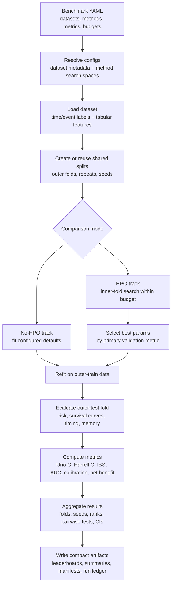

# Benchmarking Workflow

SurvArena benchmark runs compare complete survival-modeling pipelines under a
shared protocol. A run starts from YAML configuration, resolves datasets and
method adapters, creates reusable split definitions, and writes compact
experiment artifacts for downstream reporting.

## What Is Compared

Each method is evaluated as a full pipeline: model-specific preprocessing,
training, optional tuning, refit, prediction, and metric computation. The same
split definitions are reused across methods so differences reflect model
behavior rather than different train/test partitions.

The standard and manuscript configs use right-censored survival targets and the
same built-in dataset suite by default:

- `support`
- `metabric`
- `aids`
- `gbsg2`
- `flchain`
- `whas500`

## Run Geometry

The maintained benchmark profiles differ mainly by runtime and statistical
strength:

| Profile | Purpose | Typical geometry | Intended use |
| --- | --- | --- | --- |
| `smoke` | Fast wiring check | Small folds and one seed | CI, local validation, adapter sanity checks |
| `standard` | Balanced benchmark | Repeated nested CV with native core models | Routine comparisons under realistic runtime |
| `manuscript` | Full reporting run | Repeated nested CV with the full native portfolio | Paper-grade result tables and statistical summaries |

`comparison_modes` controls whether a config emits `no_hpo`, `hpo`, or both
tracks. No-HPO fits configured defaults directly. HPO uses the configured inner
folds and budget, then refits the selected configuration before outer-test
evaluation.

## Output Flow

Benchmark results are written under
`results/summary/<benchmark_id>_<model_name>_<timestamp>/`. The
human entry point is the generated experiment `README.md`; the machine entry
point is `experiment_navigator.json`.

Core artifacts include:

- fold-level metric tables
- seed and overall summaries
- leaderboards
- manuscript comparison reports, with detailed ranking and significance files
  depending on the configured artifact layout
- failure and missing-metric summaries when available
- compact per-run ledgers
- experiment manifests with config and environment metadata

For the full protocol and artifact contract, see [`protocol.md`](protocol.md).
